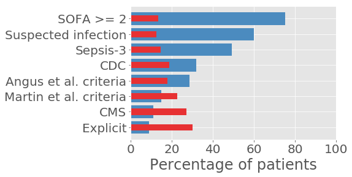

# Sepsis-3 in MIMIC-III [](https://zenodo.org/badge/latestdoi/61314230)

This is the code repository associated with [A Comparative Analysis of Sepsis Identification Methods in an Electronic Database](https://www.ncbi.nlm.nih.gov/pubmed/29303796)

The publication assessed five methods of identifying sepsis in electronic health records, and found that all five had varying cohort sizes and severity of illness as measured by in-hospital mortality rate. The results are best summarized by the following figure:



Above, we can see that, as we change the criteria used to define sepsis, the percentage of patients who satisfy the criteria decreases (blue bars) and the percent mortality of that cohort increases (red bars). For more detail please see the paper.

If you find the code useful, we would appreciate acknowledging our work with a citation: either the code directly (using the DOI badge from Zenodo), the paper summarizing the work, or both!

# Reproducing the results of the above study

Reproducing the study can be done as follows:

1. Installing necessary Python dependencies
2. Generate or acquire the CSV files which are used for analysis by...
  * Running the `sepsis-3-get-data.ipynb` notebook from start to finish
  * ... or downloading the CSV files from the MIMIC-III Derived Data Repository and analyzing those files
3. Running the analysis in `sepsis-3-main.ipynb`

## 1. Clone the repository and install necessary Python dependencies

You will need a local copy of the code in this repository. The easiest way to acquire this is to use `git` to clone the data locally. If using Ubuntu, you can install `git` easily with:

```
sudo apt-get install git
```

Next, clone the repository with the `--recursive` flag as it relies on a distinct repository (mimic-code):

```
git clone https://github.com/alistairewj/sepsis3-mimic sepsis3-mimic --recursive
```

If you already have the repository cloned on your local computer, but you didn't use the `--recursive` flag, you can clone the submodule easily:

```
cd sepsis3-mimic
git submodule update --init --recursive
```

(Optional, recommended): Create a virtual environment for this repository: `mkvirtualenv --python=python3 sepsis3-py3`

Finbally, using a package manager for Python (`pip`), you can run the following from the root directory of this repository to install all necessary python packages:

```
pip install -r requirements.txt
```

## 2. Acquire CSVs from a database with MIMIC-III

### (a) Regenerate the CSVs from a PostgreSQL database with MIMIC-III

The `sepsis-3-get-data.ipynb` notebook runs through the process of exporting the data from the database and writing it to CSV files. This notebook requires:

1. PostgreSQL version 9.4 or later
2. The MIMIC-III database installed in PostgreSQL

If you do not have the above, you can follow the [instructions on this page](https://mimic.physionet.org/gettingstarted/dbsetup/) to access and install MIMIC-III.

The `sepsis-3-get-data.ipynb` will call `query/make-tables.sql` to generate the necessary tables. You can alternatively run this directly from psql:

```
cd query
psql
\i make-tables.sql
```

This will start the generation of all the tables - which can take about an hour. You may see a lot of `NOTICE` warnings: don't worry about them. The query logic is "check if the table exists, and if it does, drop it". These warnings indicate that the table did not exist (and nor would you expect it to on a fresh install!).


### (b) Download the CSVs from the MIMIC-III Derived Data repository

TODO: This section will be populated soon.

## 3. Run analysis

`sepsis-3-main.ipynb` - this analyzes the data and reports all results found in the paper

## (Optional) Supplemental Material

Results presented in the supplemental material can be regenerated using the `supplemental-material.ipynb` file.
